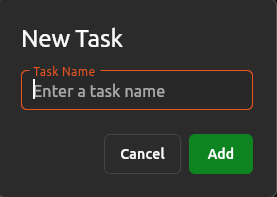
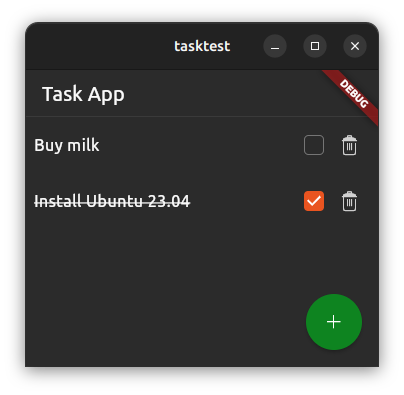

# Testing Flutter Desktop Applications

Dennis Loose (Canonical) @ Linux App Summit 2023 in Brno, Czech Republic

## Outline
* Unit tests for the business logic components
* Widget tests for the UI components
* Integration tests for the entire application

---
# Sample application: Task App
To follow along:
```
git clone https://github.com/d-loose/testing-workshop
cd taskapp
flutter run
```

Running the tests:
```
flutter test
```
You should see a few passing tests and some failing ones - we will implement those in the following sections.

---
## Unit Tests

Goal: test business logic of the application - `TaskList`
```dart
class TaskList with ChangeNotifier {
  UnmodifiableListView<Task> get tasks => ...;

  void add(Task task) {...}
  void remove(int index) {...}
  void setDone(int index, bool done) {...}
}
```

---
## Unit Tests - Example
```dart
import 'package:flutter_test/flutter_test.dart';
import 'package:taskapp/task_list.dart';

void main() {
   test('add task', () {
    // setup the component we want to test
    final taskList = TaskList();

    // perform the action we want to test
    taskList.add(Task(name: 'test_task1'));

    // verify the results
    expect(taskList.tasks, hasLength(1));
    expect(taskList.tasks.first.name, equals('test_task1'));
    expect(taskList.tasks.first.done, isFalse);
  });
}
```

---
## Unit Tests - Exercise
Implement the missing tests for the  `TaskList` class with basic assertions using [`expect(actual, matcher)`](https://api.flutter.dev/flutter/flutter_test/expect.html).

Run the tests with:
```
flutter test test/task_list_test.dart
```
Change something in the implementation and see how this affects the tests.

---
## Widget Tests - Example 1: `TaskTile`

Goal: test UI elements and callbacks of `TaskTile`


```dart
class TaskTile extends StatelessWidget {
  const TaskTile({super.key, required this.task, ...});

  final Task task;
  final ValueChanged<bool?> onChanged;
  final VoidCallback remove;
  ...
}
```

---
## `TaskTile` - Example Widget Test
```dart
void main() {
  testWidgets('remove task', (tester) async {
    var removed = false;
    final taskTile = TaskTile(
      task: const Task(name: 'Buy milk'),
      onChanged: (_) {},
      remove: () => removed = true,
    );
    await tester.pumpYaruWidget(taskTile); // wrapper around pumpWidget

    final removeButton = find.byType(YaruIconButton);
    expect(removeButton, findsOneWidget);

    await tester.tap(removeButton);
    expect(removed, isTrue);
  });
}
```

---
## Widget Tests - Exercise 1
Implement the missing tests for the `TaskTile` widget. Use [`tester`](https://api.flutter.dev/flutter/flutter_test/WidgetTester-class.html) to interact with the widget tree and [`find`](https://api.flutter.dev/flutter/flutter_test/CommonFinders-class.html) to search for widgets.
You can access a widget's properties with `tester.widget<WidgetType>(widgetFinder)`.

Run the tests with:
```
flutter test test/task_tile_test.dart
```
Change something in the implementation and see how this affects the tests.

---
## Widget Tests - Example 2: `TaskDialog`

```dart
class NewTaskDialog extends StatefulWidget {
  @visibleForTesting
  const NewTaskDialog({super.key, required this.taskList});

  final TaskList taskList;
  ...
}
```

---
## `TaskDialog` - Example Widget Test

```dart
import 'package:mocktail/mocktail.dart';

class MockTaskList extends Mock implements TaskList {}

void main() {
  testWidgets('cancel', (tester) async {
    final taskList = MockTaskList();
    registerFallbackValue(const Task(name: "")); // mocktail specific

    await tester.pumpYaruWidget(NewTaskDialog(taskList: taskList));
    await tester.pumpAndSettle();

    await tester.tap(find.text("Cancel"));
    await tester.pumpAndSettle();

    verifyNever(() => taskList.add(any()));
  });
}
```

---
## Widget Tests - Exercise 2
Implement the missing test for the `TaskDialog` widget. Use [`verify()`](https://pub.dev/documentation/mocktail/latest/mocktail/verify.html) to check if a method was called on a mock object.

Run the tests with:
```
flutter test test/task_dialog_test.dart
```
Change something in the implementation and see how this affects the tests.

---
## Widget Tests - Example 3: `TaskPage`
<!--  -->
```dart
class TaskPage extends StatelessWidget {
  @visibleForTesting
  const TaskPage({super.key});

  static Widget create(BuildContext context) {
    return ChangeNotifierProvider(
      create: (_) => TaskList(),
      builder: (context, _) => const TaskPage(),
    );
  }
  ...
}
```

---
## `TaskPage` - Example Widget Test

```dart
void main() {
  testWidgets('empty list', (tester) async {
    final taskList = MockTaskList();
    when(() => taskList.tasks).thenReturn(UnmodifiableListView([]));
    await tester.pumpYaruWidget(ChangeNotifierProvider.value(
      value: taskList,
      child: const TaskPage(),
    ));
    await tester.pumpAndSettle();

    expect(find.byType(TaskTile), findsNothing);
  });
}
```

---
## Widget Tests - Exercise 3
Implement the missing tests for the `TaskPage` widget. Use `when()` to set up the return values of mock objects.

Run the tests with:
```
flutter test test/task_page_test.dart
```
Change something in the implementation and see how this affects the tests.

---
## Integration Tests

Goal: test the application as a whole and ensure all components are interoperating correctly

``` dart
import 'package:integration_test/integration_test.dart';
import 'package:taskapp/main.dart' as app;

void main() {
  IntegrationTestWidgetsFlutterBinding.ensureInitialized();

  testWidgets('integration test', (tester) async {
    app.main(); // run the application
    await tester.pumpAndSettle();

    // do some tests
    ...
  });
}
```

---
## Integration Tests - Exercise

Implement an integration test that adds a new task through the dialog, marks it as done and removes it. Verify that the UI is updated accordingly at each point.